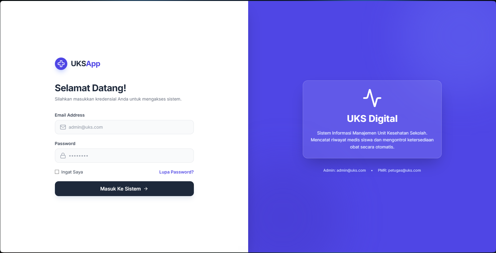
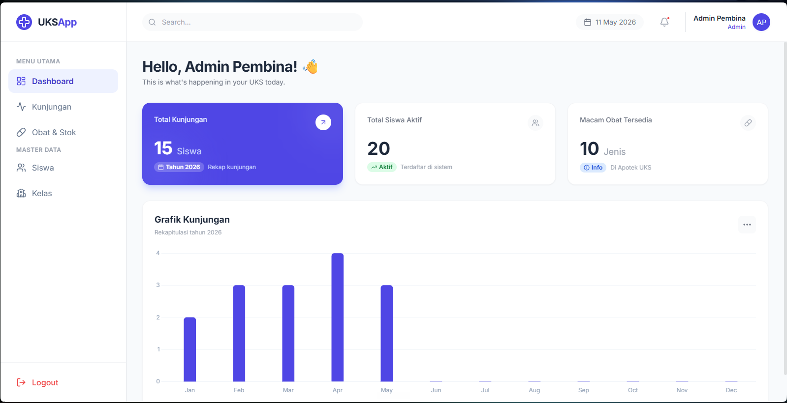
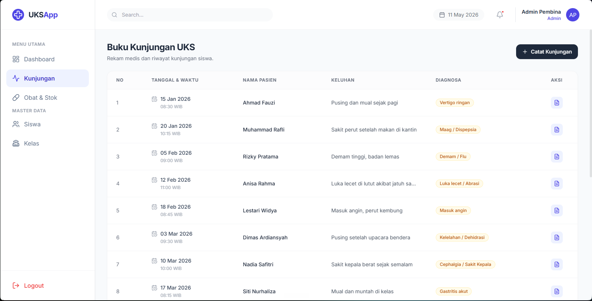
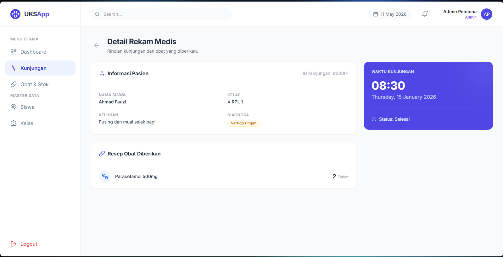
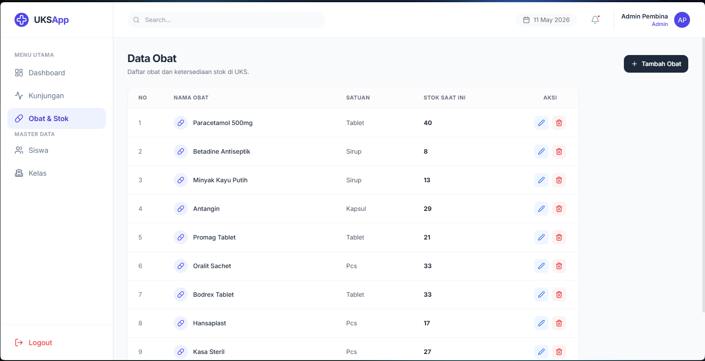
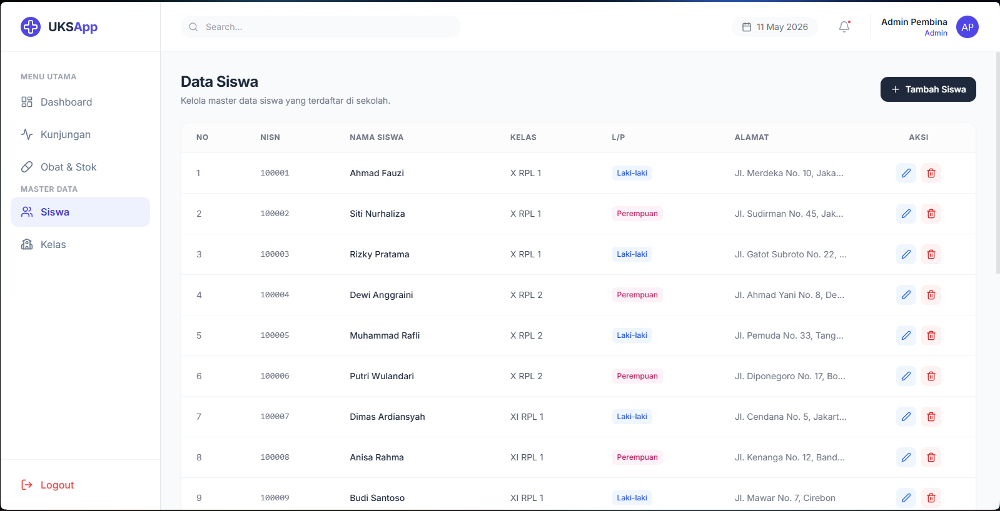
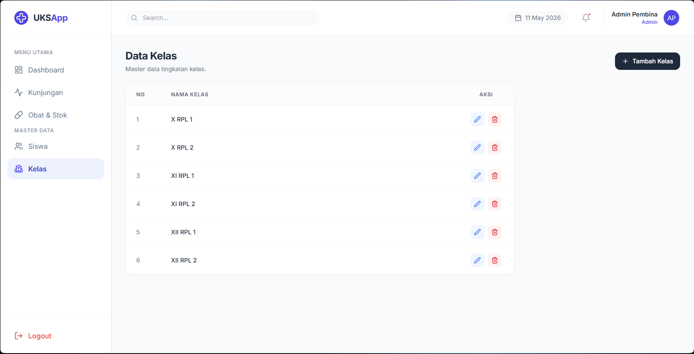
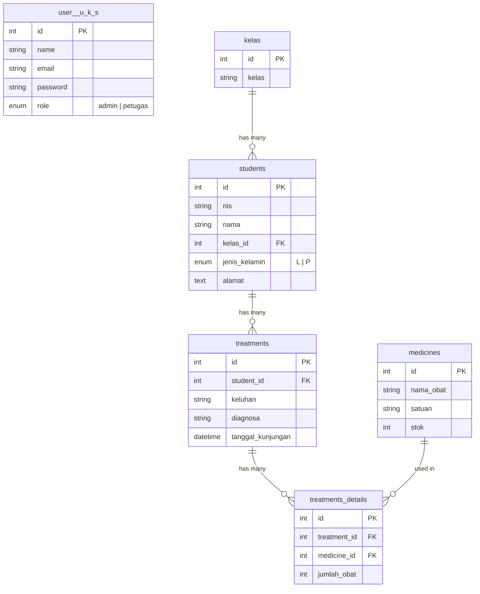

# 🏥 UKS App — Sistem Informasi Manajemen Unit Kesehatan Sekolah

Aplikasi web untuk mengelola operasional **Unit Kesehatan Sekolah (UKS)** berbasis **Laravel 11** dan **Tailwind CSS v3**. Fitur utama meliputi pencatatan kunjungan pasien, manajemen stok obat otomatis, dan sistem multi-user berbasis *role*.

---

## 🛠 Tech Stack

| Teknologi              | Versi  | Kegunaan                 |
| ---------------------- | ------ | ------------------------ |
| **Laravel**      | 11.x   | Backend Framework (MVC)  |
| **Tailwind CSS** | 3.x    | Styling & UI Components  |
| **Vite**         | 6.x    | Asset Bundler            |
| **Chart.js**     | 4.x    | Grafik Kunjungan Bulanan |
| **Lucide Icons** | Latest | Icon Library             |
| **MySQL**        | 8.x    | Database                 |

---

## 🚀 Panduan Instalasi

### 1. Persiapan Sistem

Pastikan sudah terinstall:

- **PHP** ≥ 8.2
- **Composer**
- **Node.js & NPM**
- **MySQL** (via XAMPP / Laragon)

### 2. Clone & Install

```bash
git clone https://github.com/Radiant213/web-uks-mapil-keren.git
cd web-uks-mapil-keren

# Install dependensi PHP
composer install

# Install dependensi Node.js
npm install
```

### 3. Konfigurasi Environment

```bash
cp .env.example .env
php artisan key:generate
```

Edit file `.env`, sesuaikan konfigurasi database:

```env
DB_CONNECTION=mysql
DB_HOST=127.0.0.1
DB_PORT=3306
DB_DATABASE=db_uks_keren
DB_USERNAME=root
DB_PASSWORD=
```

### 4. Migrasi & Seeding Database

```bash
php artisan migrate:fresh --seed
```

> ⚠️ Perintah di atas akan membuat tabel baru dan mengisi data dummy (akun, kelas, siswa, obat, kunjungan).

### 5. Jalankan Server

```bash
npm run build
php artisan serve
```

Buka di browser: 👉 **http://127.0.0.1:8000**

---

## 🔐 Akun Login Default

| Role                      | Email               | Password     | Hak Akses                                         |
| ------------------------- | ------------------- | ------------ | ------------------------------------------------- |
| **Admin (Pembina)** | `admin@uks.com`   | `password` | Akses penuh: CRUD Siswa, Kelas, Obat, Kunjungan   |
| **Petugas (PMR)**   | `petugas@uks.com` | `password` | Akses terbatas: Catat Kunjungan & Lihat Stok Obat |

---

## ✨ Fitur Utama

### 👨‍⚕️ Admin (Pembina UKS)

- ✅ Dashboard statistik (Total Kunjungan, Siswa, Obat + Grafik Bulanan)
- ✅ CRUD Data Siswa (NIS, Nama, Kelas, Jenis Kelamin, Alamat)
- ✅ CRUD Data Kelas
- ✅ CRUD Data Obat (Nama, Satuan, Stok)
- ✅ Pencatatan Kunjungan UKS + Pemberian Obat
- ✅ Otomatis kurangi stok obat saat kunjungan (Database Transaction)
- ✅ Detail rekam medis per kunjungan

### 👩‍⚕️ Petugas (PMR)

- ✅ Dashboard statistik
- ✅ Pencatatan Kunjungan UKS + Pemberian Obat
- ✅ Lihat daftar dan stok obat
- ❌ Tidak bisa akses Master Data (Siswa, Kelas, Tambah/Edit/Hapus Obat)

---

## 📸 Screenshots

### Halaman Login



### Dashboard



### Data Kunjungan UKS



### Detail Rekam Medis



### Data Obat & Stok



### Data Siswa



### Data Kelas



---

## 🗄 Struktur Database



---

## 📂 Data Dummy (Seeder)

Setelah menjalankan `php artisan db:seed`, database akan terisi:

| Data                | Jumlah | Keterangan                            |
| ------------------- | ------ | ------------------------------------- |
| **User**      | 2      | 1 Admin + 1 Petugas                   |
| **Kelas**     | 6      | X RPL 1/2, XI RPL 1/2, XII RPL 1/2    |
| **Siswa**     | 20     | Tersebar di 6 kelas                   |
| **Obat**      | 10     | Paracetamol, Betadine, Antangin, dll  |
| **Kunjungan** | 15     | Jan–Mei 2026 (chart terisi otomatis) |

---

## 🧑‍💻 Kontributor

Dibuat untuk memenuhi tugas mata pelajaran **Mapil** — Sistem Informasi UKS Sekolah.

---

## 📄 Lisensi

Project ini dibuat untuk keperluan edukasi.
